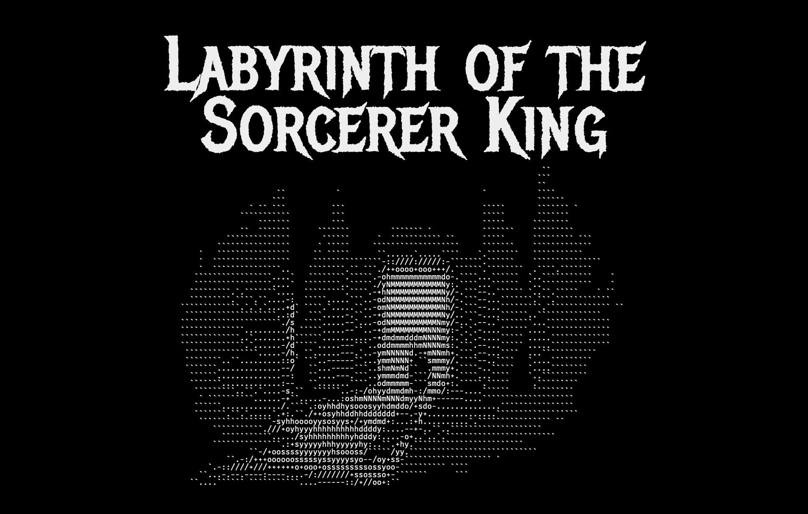
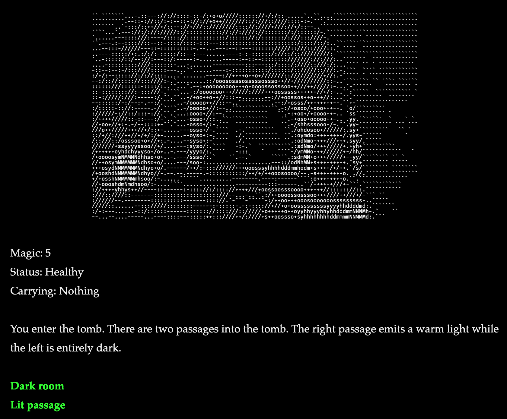
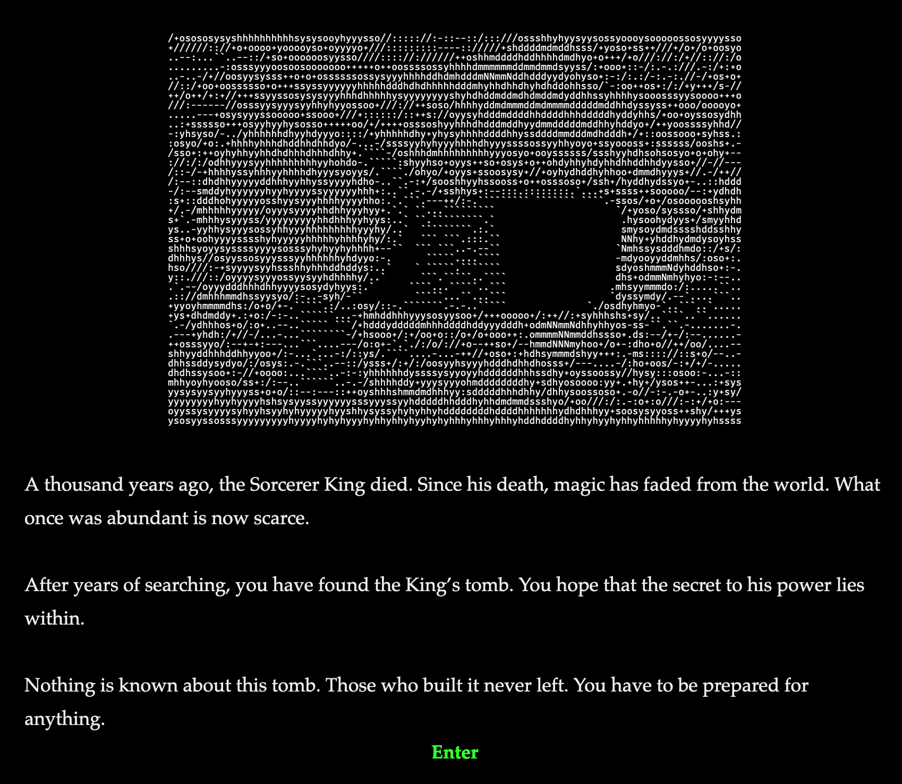
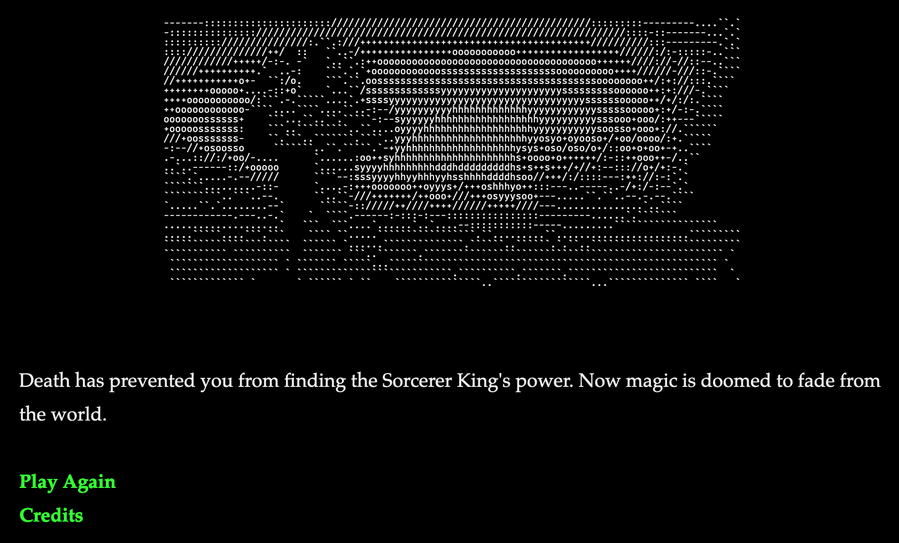

# Labyrinth of the Sorcerer King

## Overview
### History
This is a game I made as a school assignment in late-2018. I have edited this version to remove copyrighted assets and improve formatting.

### Description

*Labyrinth of the Sorcerer King* is a text adventure in the style of 1980s dungeon crawlers. The main aesthetic of the game is a black background and white text, with other text colors highlighting important objects and directions. All images are in ASCII art or resemble early computer graphics using filters. The sounds of wind blowing through the tunnels and water dripping from the ceiling create an atmosphere of isolation for the player. The clanging of metal or cracking in stone will signal the turning of a mechanism and alert the player that something is happening.

Players take on the role of a wizard navigating the lost tomb of the Sorcerer King in search of limitless power. Beyond what the wizard is looking for why he seeks this power and what he intends to do with it is up to the player’s imagination. As he goes deeper, an implied story by the state of the tomb. Much of the story remains unknown, but it ends in a lost tomb and many powerful relics left unattended.

The wizard must find his way to the bottom of the decaying tomb while dealing with traps, puzzles, magical artifacts, hidden passages, and malfunctioning mechanisms. He can cast a limited number of spells per day to overcome challenges. Artifacts scattered throughout the tomb have magical properties that can help or hinder the wizard depending on where they’re used. He is alone in an unfamiliar location. Everything presents a potential danger but everything also has use if one tries hard enough. The mechanics give players multiple ways to solve a problem, some of them have consequences. This leads into a dynamic where players will look for artifacts to solve a puzzle to save their spells for later in the game.

Players have to be careful when deciding on an action. Going down the wrong path may lead to a trap. Entering a dark room without light puts the wizard at risk of injury. The wizard may sustain injuries over the course of the game, these injuries make puzzles harder to solve without using magic. A limp prevents players from running or jumping and makes it hard to balance. The consequences of their actions can lead to an emergent narrative where the wizard grows more injured as he progresses through the tomb, reaching his goal at near death.

## Credits

### Writing and Programming
[Brandon Vout](https://brandonvout.com/)

### Made In
[Twine](https://twinery.org/)

### Inventory Macros
[F2Andy](https://strugglingwithtwine.blogspot.com/2014/03/handling-inventory.html)

### Images Found With
[Creative Commons Search](https://search.creativecommons.org/)

### ASCII Art Made Using
[TEXT-IMAGE.com/convert](https://www.text-image.com/convert/)

### Sound Effects
[freesound.org](https://freesound.org/)

### Music
[Exotics](https://incompetech.com/music/royalty-free/index.html?isrc=USUAN1100233&Search=Search) Kevin MacLeod ([incompetech.com](https://incompetech.com/))  
Licensed under Creative Commons: By Attribution 3.0 License  
<http://creativecommons.org/licenses/by/3.0/>

[Halls of the Undead](https://incompetech.com/music/royalty-free/index.html?isrc=USUAN1100355&Search=Search) Kevin MacLeod ([incompetech.com](https://incompetech.com/))  
Licensed under Creative Commons: By Attribution 3.0 License  
<http://creativecommons.org/licenses/by/3.0/>

## Repositories
- [Github](https://github.com/bvout/sorcererking-twine)
- [Gitlab](https://gitlab.com/bvout/sorcererking-twine)

## License
Published under the **[GNU General Public License v3.0](./LICENSE)**
